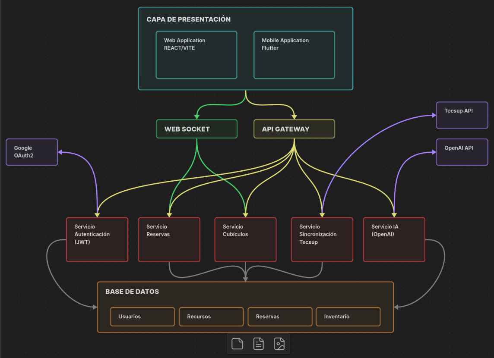
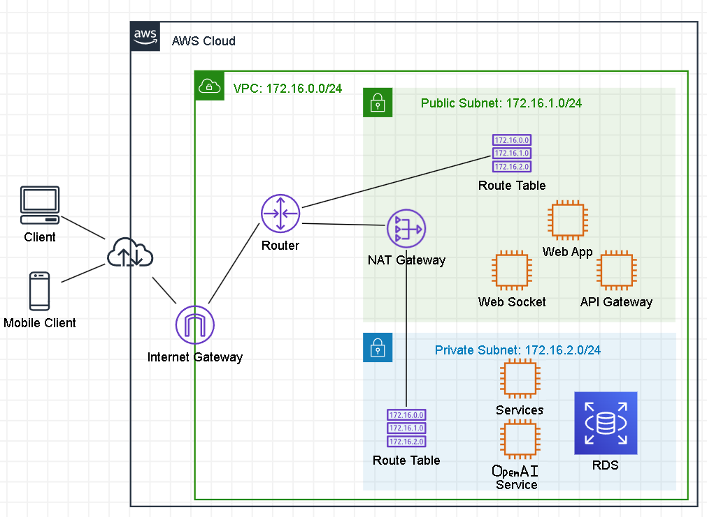

# 🏗️ Microservices Resource Management System

A full-stack resource management platform built with a real **microservices architecture**, featuring an API Gateway, WebSocket server with Redis Pub/Sub, AI-powered assistant, Google OAuth2 authentication, and cloud deployment on AWS.

> Developed as a thesis project at TECSUP — designed with production-oriented architectural patterns from the ground up.

---

## 📐 Architecture Overview



The system is organized into independent services, each with its own codebase, database schema, and deployment container.

```
Client (React/Vite)
    │
    ├──► API Gateway (port 3000)  ──► /auth      → Auth Service       (port 5000)
    │                              ──► /cubicles  → Cubicle Service    (port 5001)
    │                              ──► /loans     → Tool Loan Service  (port 5002)
    │                              ──► /openai    → AI Service         (port 5005)
    │
    └──► WebSocket Server (port 4000) ◄── Redis Pub/Sub ◄── Tool Loan Service
```

### AWS Deployment



- **VPC** `172.16.0.0/24` with isolated public and private subnets
- **Public Subnet** `172.16.1.0/24`: Web App, API Gateway, WebSocket Server, NAT Gateway
- **Private Subnet** `172.16.2.0/24`: Backend microservices, RDS (MySQL), AI Service
- **Internet Gateway** for external client access
- **NAT Gateway** for outbound traffic from private subnet

---

## ✨ Features

- 🔐 **Authentication** — Google OAuth2 via Passport.js + JWT-based session handling
- 🏢 **Cubicle Reservations** — CRUD for study cubicle booking with availability management
- 🔧 **Tool Loan Management** — Equipment inventory and loan request workflows
- 📡 **Real-time Updates** — WebSocket server (Socket.io) synced via Redis Pub/Sub
- 🤖 **AI Assistant** — Conversational assistant powered by DeepSeek API with live equipment data context
- 📊 **Admin Dashboard** — Loan and reservation dashboards with charts (Recharts) and PDF/Excel export
- ☁️ **Cloud Deployed** — AWS EC2 instances across public/private subnets with RDS

---

## 🛠️ Tech Stack

### Frontend
| Technology | Purpose |
|---|---|
| React + Vite | SPA framework |
| React Router | Client-side routing |
| Axios | HTTP client |
| Socket.io Client | Real-time events |
| Recharts | Data visualization |
| jsPDF + xlsx | Report export |
| jwt-decode | JWT parsing |

### Backend Services
| Service | Technology | Responsibility |
|---|---|---|
| API Gateway | Express + http-proxy-middleware | Request routing to microservices |
| Auth Service | Express + Passport.js + Sequelize | Google OAuth2, JWT issuance |
| Cubicle Service | Express + Sequelize + MySQL | Cubicle CRUD and reservations |
| Tool Loan Service | Express + Sequelize + Redis | Equipment and loan management |
| AI Service | Express + DeepSeek API | AI assistant with DB context |
| WebSocket Server | Socket.io + Redis | Real-time event broadcasting |

### Infrastructure
| Tool | Purpose |
|---|---|
| MySQL (AWS RDS) | Relational database |
| Redis | Pub/Sub messaging between services |
| Docker | Service containerization |
| AWS EC2 | Compute instances |
| AWS VPC | Network isolation |
| Google OAuth2 | Identity provider |

---

## 📁 Project Structure

```
├── backend/
│   ├── api-gateway/          # Request router (Express proxy)
│   ├── websocket-server/     # Socket.io + Redis subscriber
│   └── services/
│       ├── auth/             # Auth: OAuth2, JWT, Sequelize ORM
│       ├── cubicle-reservation/  # Cubicle booking logic
│       ├── tool-loan/        # Equipment and loan management
│       └── openai/           # AI assistant (DeepSeek)
└── frontend/
    └── src/
        ├── api/              # Axios clients per service
        ├── auth/             # Protected route + auth context
        ├── pages/
        │   ├── admin/        # Admin dashboards (loans, reservations)
        │   ├── cubicles/     # Cubicle browsing and booking
        │   └── tools/        # Tool catalog, loans, AI assistant
        └── components/       # Shared UI components
```

---

## 🚀 Getting Started

### Prerequisites

- Node.js 18+
- MySQL (local or AWS RDS)
- Redis (local or cloud)
- Google OAuth2 credentials
- DeepSeek API key

### Environment Variables

Each service has its own `.env.example`. Copy and configure before running:

```bash
# Example for Auth Service
cp backend/services/auth/.env.example backend/services/auth/.env
```

Key variables across services:

```env
# Auth Service
DB_HOST=...
DB_USER=...
DB_PASSWORD=...
JWT_SECRET=...
GOOGLE_CLIENT_ID=...
GOOGLE_CLIENT_SECRET=...

# AI Service
DEEPSEEK_BASE_URL=https://api.deepseek.com
DEEPSEEK_API_KEY=...
EQUIPMENT_URL=http://localhost:3000/loans/equipment

# WebSocket Server
REDIS_URL=redis://localhost:6379
```

### Running Locally

Start each service in its own terminal or use Docker:

```bash
# API Gateway
cd backend/api-gateway && npm install && node server.js

# Auth Service
cd backend/services/auth && npm install && node server.js

# Cubicle Service
cd backend/services/cubicle-reservation && npm install && node server.js

# Tool Loan Service
cd backend/services/tool-loan && npm install && node server.js

# AI Service
cd backend/services/openai && npm install && node server.js

# WebSocket Server
cd backend/websocket-server && npm install && node server.js

# Frontend
cd frontend && npm install && npm run dev
```

### Database Setup (Sequelize)

```bash
cd backend/services/auth
npx sequelize-cli db:migrate
npx sequelize-cli db:seed:all
```

Repeat for `cubicle-reservation` and `tool-loan` services.

---

## 🔌 API Endpoints (via Gateway)

All requests go through the API Gateway at `http://localhost:3000`.

| Method | Endpoint | Service | Description |
|---|---|---|---|
| GET | `/auth/google` | Auth | Initiate Google OAuth2 |
| POST | `/auth/login` | Auth | JWT login |
| GET | `/cubicles` | Cubicle | List all cubicles |
| POST | `/cubicles/reservations` | Cubicle | Create reservation |
| GET | `/loans/equipment` | Tool Loan | List equipment |
| POST | `/loans` | Tool Loan | Request a loan |
| POST | `/openai/chat` | AI | Chat with assistant |

---

## 📡 Real-time Flow (Redis Pub/Sub + WebSocket)

1. **Tool Loan Service** publishes an event to Redis channel `events` when a loan state changes
2. **WebSocket Server** is subscribed to that channel via Redis client
3. On receiving an event, it broadcasts to all connected Socket.io clients
4. **Frontend** updates the UI in real time without polling

```js
// Publisher (tool-loan service)
redisClient.publish("events", JSON.stringify({ type: "loan:updated", data: loan }));

// Subscriber (websocket-server)
redisSubscriber.subscribe("events", (message) => {
  const event = JSON.parse(message);
  io.emit(event.type, event.data);
});
```

---

## 🤖 AI Assistant

The AI service uses the **DeepSeek API** (OpenAI-compatible interface) with a custom system prompt and live database context injected per request. It supports full conversation history for multi-turn interactions.

```js
messages: [
  { role: "system", content: systemPrompt },
  ...conversationHistory,
  { role: "user", content: `User says: ${message}. Available equipment: ${JSON.stringify(dbData)}` }
]
```

---

## 👤 Author

**Angel Delgado Gómez**  
Full Stack Developer · TECSUP Graduate  
[GitHub](https://github.com/xangel1111) · [LinkedIn](https://linkedin.com/in/angel-delgado-gomez)
